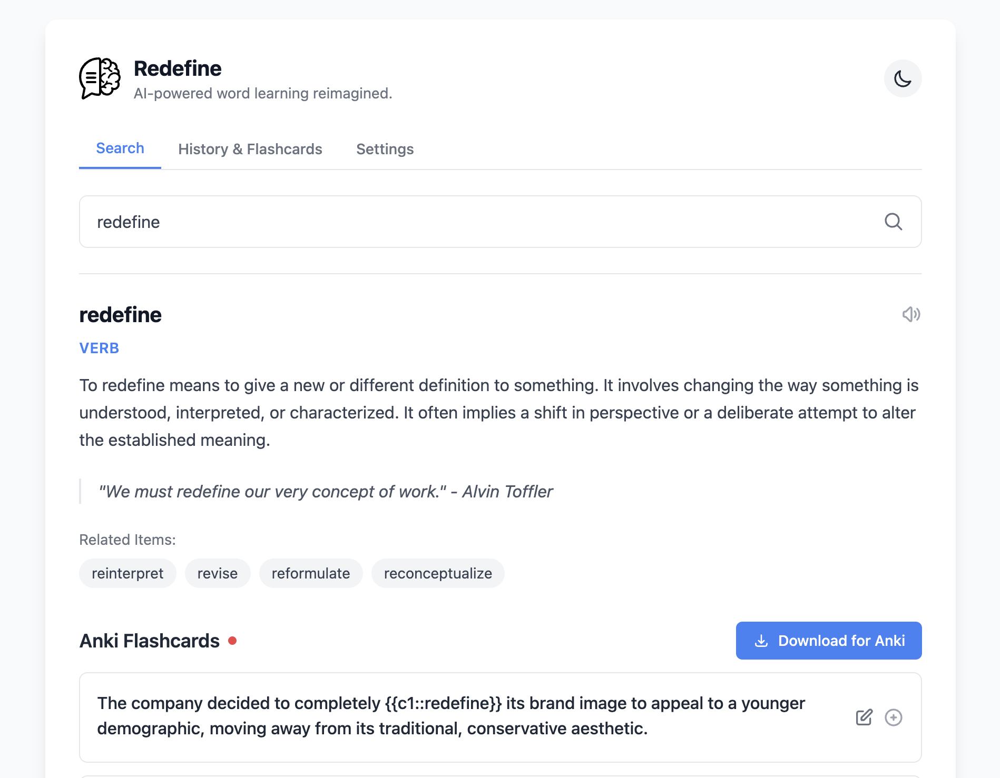

# Redefine

**AI-powered word learning, reimagined.**



Redefine is an intelligent vocabulary learning app that uses LLMs to generate rich explanations and Anki flashcards for any word, phrase, or concept.

## ✨ Features

- **Personalized Learning** — Everyone learns differently. Edit the prompts to generate definitions and flashcards the way you understand best—change the language, style, complexity, or format to match how your brain works
- **AI-Powered Explanations** — Get clear, contextual explanations with pronunciation, related concepts, and usage examples
- **Smart Flashcard Generation** — Auto-generates Anki-style cloze cards embedded in real-world sentences
- **Multi-Provider LLM Support** — Works with OpenAI, Anthropic Claude, and Google Gemini
- **Anki Integration** — Export flashcards to Anki with a single tap
- **Mobile-First Design** — Built for learning on the go. Instead of searching in your browser, search here and get flashcards you can import directly into Anki
- **Lightweight** — Uses only ~15MB of memory
- **Self-Hosted** — Your data stays with you

## 🚀 Getting Started

### Option 1: Docker Compose (Recommended)

Create a `docker-compose.yml` file:

```yaml
services:
  redefine:
    image: ghcr.io/kirarpit/redefine:latest
    container_name: redefine
    ports:
      - "5612:5000"
    environment:
      - SALT_KEY=${SALT_KEY}
    volumes:
      - redefine_data:/data
    read_only: true
    cap_drop:
      - ALL
    security_opt:
      - no-new-privileges:true
    restart: unless-stopped

volumes:
  redefine_data:
```

Create a `.env` file with a salt key:

```bash
# Generate a salt key and save to .env
echo "SALT_KEY=$(openssl rand -base64 32)" > .env
```

Start the app:

```bash
docker-compose up -d
```

Open [http://localhost:5612](http://localhost:5612) and add your LLM in Settings.

> **Important**: Keep your `.env` file safe! If you lose the `SALT_KEY`, you'll lose access to your encrypted API keys.

### Option 2: Docker Run

```bash
# Generate a salt key and save to .env
echo "SALT_KEY=$(openssl rand -base64 32)" > .env

# Run the container
docker run -d \
  --name redefine \
  -p 5612:5000 \
  --env-file .env \
  -v redefine_data:/data \
  --read-only \
  --cap-drop=ALL \
  --security-opt=no-new-privileges:true \
  --restart unless-stopped \
  ghcr.io/kirarpit/redefine:latest
```

Open [http://localhost:5612](http://localhost:5612) and add your LLM in Settings.

> **Important**: Keep your `.env` file safe! If you lose the `SALT_KEY`, you'll lose access to your encrypted API keys.

## 🔧 Configuration

### Adding an LLM Model

1. Navigate to **Settings**
2. Click **Add Your First Model**
3. Enter your model details:
   - **Model ID**: `gemini/gemini-2.0-flash` or `gemini/gemini-2.5-flash-lite` (recommended)
   - **API Key**: Your API key

### Recommended: Gemini (Free)

We recommend **`gemini/gemini-2.0-flash`** or **`gemini/gemini-2.5-flash-lite`** — both are fast, high-quality, and have generous free tiers.

👉 [Get a free API key from Google AI Studio](https://aistudio.google.com/apikey)

### Other Supported Models

| Provider  | Format              | Example                                |
| --------- | ------------------- | -------------------------------------- |
| Google    | `google/<model>`    | `gemini/gemini-2.0-flash`              |
| OpenAI    | `openai/<model>`    | `openai/gpt-4o`                        |
| Anthropic | `anthropic/<model>` | `anthropic/claude-3-5-sonnet-20241022` |

### Anki Integration

**On Mobile (Recommended):**

The easiest option is to tap "Download for Anki" and import the file directly into AnkiMobile or AnkiDroid.

For automatic syncing, you can run [AnkiConnect](https://ankiweb.net/shared/info/2055492159) on your phone—Redefine will detect it and enable "Send to Anki" for one-tap imports. (Note: AnkiConnect integration has been tested on mobile only.)

## 🛠️ Local Development

If you want to contribute or customize:

```bash
# Start the backend
cd server/go
./run.sh

# In a new terminal, start the frontend
cd web
npm install
npm run start
```

Open [http://localhost:3000](http://localhost:3000)

## 🤝 Contributing

Contributions are welcome! Please feel free to submit a Pull Request.

## 📄 License

This project is licensed under the MIT License.

---

<p align="center">
  <em>Created with ❤️ for smarter learning</em>
</p>
